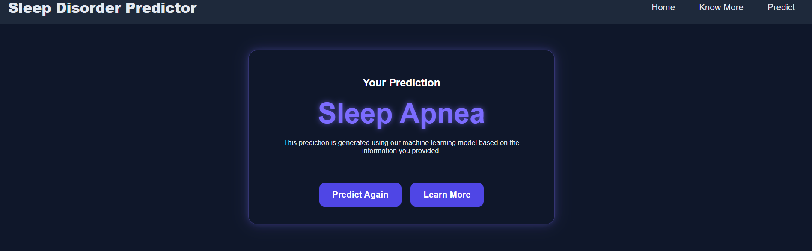

# 🌙 Sleep Disorder Predictor

An AI-powered web application that predicts sleep disorders using an XGBoost machine learning model trained on a large sleep health and lifestyle dataset. The application allows users to enter their health and lifestyle information and instantly receive a prediction through a responsive Flask web interface.

---

## 🚀 Live Demo

🌐 https://sleep-disorder-predictor-fkxi.onrender.com

---

## 📖 Overview

Sleep plays a vital role in maintaining physical and mental health. This project predicts whether a user is likely to have a sleep disorder by analyzing multiple health and lifestyle factors.

The application combines machine learning with a user-friendly web interface and was developed using:

- Python
- Flask
- XGBoost
- HTML
- CSS

---

## ✨ Features

- Responsive website (Desktop & Mobile)
- Modern UI with dark theme
- Machine Learning prediction using XGBoost
- Interactive prediction form
- Sleep awareness information
- Healthy sleep tips
- Fast prediction results


---
## 📈 Model Performance

The XGBoost model was evaluated using a train-test split on the dataset.

| Metric | Score |
|--------|-------|
| Accuracy | **97.30%** |
| Precision | **97.30%** |
| Recall | **97.30%** |
| F1 Score | **97.30%** |

The model successfully classifies three classes:

- Healthy
- Insomnia
- Sleep Apnea

---


## 🖼️ Screenshots

### Home Page
The landing page introduces the application, highlights its purpose, and provides quick access to the prediction tool.

.png)

The lower section provides healthy sleep tips and explains how the prediction system works.
.png)

.png)

### Prediction Page

Users enter their lifestyle and health information to receive a prediction.

.png)

.png)


### Result Page

The application displays the predicted sleep disorder based on the provided inputs.



### 📚 Know More

The **Know More** page provides educational information about sleep disorders, their causes, symptoms, prevention, and healthy sleep habits.

.png)

.png)

.png)

.png)

.png)

---

## 🛠️ Tech Stack

### Frontend

- HTML5
- CSS3

### Backend

- Python
- Flask

### Machine Learning

- XGBoost
- Pandas
- NumPy
- Scikit-learn

### Deployment

- Render

---

## 📊 Dataset

The model was trained on a sleep health dataset containing approximately **15,000 records** with the following features:

- Age
- Gender
- Occupation
- Sleep Duration
- Physical Activity
- Stress Level
- BMI Category
- Blood Pressure
- Heart Rate
- Daily Steps

Target Variable:

- Sleep Disorder (Healthy, Insomnia, Sleep Apnea)

---

## ⚙️ Installation

Clone the repository

```bash
git clone https://github.com/Urvi1408/Sleep-Disorder-Predictor.git
```

Move into the project

```bash
cd Sleep-Disorder-Predictor
```

Install dependencies

```bash
pip install -r requirements.txt
```

Run the application

```bash
python app.py
```

Open

```
http://127.0.0.1:8000
```

---

## 📂 Project Structure

```text
Sleep-Disorder-Predictor/
│
├── app.py                          # Flask application
├── preprocess.py                   # Data preprocessing
├── train_model.py                  # Model training script
│
├── model.pkl                       # Trained XGBoost model
├── encoders.pkl                    # Saved feature encoders
├── target_encoder.pkl              # Target label encoder
│
├── requirements.txt                # Python dependencies
├── README.md                       # Project documentation
├── Sleep_Data_Sampled.csv
│
├── static/
│   ├── favicon.ico
│   ├── style.css
│   └── images/
│       └── sleep.png
│
├── templates/
│   ├── index.html
│   ├── info.html
│   ├── predict.html
│   └── result.html
│
└── screenshots/
    ├── home(1).png
    ├── home(2).png
    ├── home(3).png
    ├── know more(1).png
    ├── know more(2).png
    ├── know more(3).png
    ├── know more(4).png
    ├── know more(5).png
    ├── predict(1).png
    ├── predict(2).png
    └── result.png
```
---
## 🚀 Future Improvements

- Add confidence scores for each prediction.
- Visualize sleep trends with interactive charts.
- Store prediction history for registered users.
- Add multilingual support.

---

## 👩‍💻 Developed By

**Urvi Mullick**

GitHub: https://github.com/Urvi1408

Portfolio: https://urvi1408.github.io/

---

## 🤝 Acknowledgements

This project was developed as part of a collaborative academic project. I led the development of the web application, including the frontend, Flask backend integration, preprocessing pipeline, responsive UI design, deployment, testing, and documentation. Contributions from team members supported dataset preparation and the machine learning model development.

